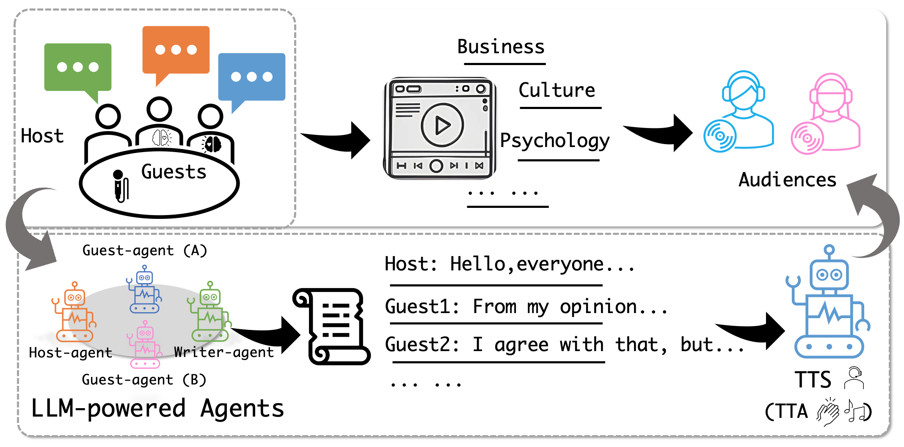

# <span style="color: blue;">🎧</span> PodAgent: A Comprehensive Framework for Podcast Generation
[](https://arxiv.org/abs/2503.00455) [](https://podcast-agent.github.io/demo/) 


This repository contains the official implementation of ["PodAgent: A Comprehensive Framework for Podcast Generation"](https://arxiv.org/abs/2503.00455).

Given the topic to be discussed, PodAgent will simulate human behavior to create podcast-like audio presented as a talk show, featuring one host and several guests. The show will include diverse and insightful viewpoints, delivered in appropriate voices, along with structured sound effects and background music to enrich the listening experience.


<p align="center">
  
</p>

<hr>

## News
- 🥂 2025.03: PodAgent is released! We currently support podcast generation in two languages: English and Chinese.
- 🥂 2025.05: PodAgent is accepted by ACL 2025 Findings!

## Download Codes
1. Download PodAgent
```bash
git clone https://github.com/yujxx/PodAgent.git
```
2. Download CosyVoice
```bash
cd PodAgent
mkdir TTS
cd TTS
git clone https://github.com/FunAudioLLM/CosyVoice.git
cd CosyVoice
git submodule update --init --recursive
cd ../..
```

## Environment Setup
1. Install the environment (might take some time)
```bash
bash ./scripts/EnvsSetup.sh
```
- Or, setup the environment step by step (recommended):
```bash
conda create -n podcast -y python=3.10
conda activate podcast
conda install -y -c conda-forge pynini==2.1.5
pip install -r TTS/CosyVoice/requirements.txt -i https://mirrors.aliyun.com/pypi/simple/ --trusted-host=mirrors.aliyun.com
pip install -U git+https://git@github.com/facebookresearch/audiocraft@c5157b5bf14bf83449c17ea1eeb66c19fb4bc7f0#egg=audiocraft
pip install pip==23.2.1
pip install -r requirements.txt
```
2. Activate the conda environment
```bash
conda activate podcast
```

## Download Models
Pre-download the models (might take some time)
```bash
python scripts/download_models.py
```

## Services Setup
- Set environment variables for using API services [GPT-4 API](https://platform.openai.com/account/api-keys)
```bash
export OPENAI_BASE_URL=your_openai_url_here
export PODAGENT_OPENAI_KEY=your_openai_key_here
export PODAGENT_SERVICE_PORT=8021
export PODAGENT_SERVICE_URL=127.0.0.1
export PODAGENT_MAX_SCRIPT_LINES=999
```
- Start Python API services (e.g., Text-to-Speech, Text-to-Audio)
```bash
bash scripts/start_services.sh
```
- After that, please wait a moment and check the log in services_logs/service.out. When you see the following output, it means the services are ready to be called.
```bash
 * Running on http://127.0.0.1:8021
```
- (Optional) Kill the running services when you finish the usage. 
```bash
python scripts/kill_services.py
```

## Usage
```bash
python podagent.py --topic "What are the primary factors that influence consumer behavior?" --guest-number "2" --session-id "test"
```
- (Optional) If you want to reuse responses for repeated requests (e.g., during debugging), you can enable caching:
```bash
export USE_OPENAI_CACHE=True
```

## Citation
If you find this work useful, you can cite the paper below:

    @misc{xiao2025podagentcomprehensiveframeworkpodcast,
          title={PodAgent: A Comprehensive Framework for Podcast Generation}, 
          author={Yujia Xiao and Lei He and Haohan Guo and Fenglong Xie and Tan Lee},
          year={2025},
          eprint={2503.00455},
          archivePrefix={arXiv},
          primaryClass={cs.SD},
          url={https://arxiv.org/abs/2503.00455}, 
    }

## Appreciation
- [WavJourney](https://github.com/Audio-AGI/WavJourney) for providing an extensive audio generation workflow.
- [CosyVoice2](https://github.com/FunAudioLLM/CosyVoice) for a zero-shot text-to-speech synthesis model.
- [AudioCraft](https://github.com/facebookresearch/audiocraft) for state-of-the-art audio generation models.

## Disclaimer
1. We are not liable for any audio generated using the semantics produced by this model. Please ensure that it is not used for any illegal purposes.
2. We provide voice libraries under data/voice_presets_cv_* for quick usage. The .wav files under voice_presets_cv_en and voice_presets_cv_zh are sourced from [LibriTTS-R](https://openslr.org/141/) and [AISHELL-3](https://openslr.org/93/), respectively. Please ensure their usage complies with the respective licenses.
